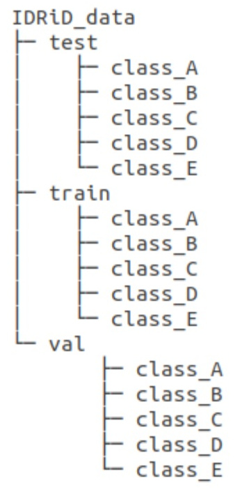

## RETFound - A foundation model for retinal imaging


This is the official repo for [RETFound: a foundation model for generalizable disease detection from retinal images](https://www.nature.com/articles/s41586-023-06555-x), which is based on [MAE](https://github.com/facebookresearch/mae):

Please contact 	**ykzhoua@gmail.com** or **yukun.zhou.19@ucl.ac.uk** if you have questions.

Keras version implemented by Yuka Kihara can be found [here](https://github.com/uw-biomedical-ml/RETFound_MAE)


### Key features

- RETFound is pre-trained on 1.6 million retinal images with self-supervised learning
- RETFound has been validated in multiple disease detection tasks
- RETFound can be efficiently adapted to customised tasks


### News

- 2023/09: a [visualisation demo](https://github.com/rmaphoh/RETFound_MAE/blob/main/RETFound_visualize.ipynb) is added
- 2023/10: change the hyperparameter of [input_size](https://github.com/rmaphoh/RETFound_MAE#:~:text=finetune%20./RETFound_cfp_weights.pth%20%5C-,%2D%2Dinput_size%20224,-For%20evaluation%20only) for any image size


### Install environment

1. Create environment with conda:

```
conda create -n retfound python=3.7.5 -y
conda activate retfound
```

2. Install dependencies

```
git clone https://github.com/rmaphoh/RETFound_MAE/
cd RETFound_MAE
pip install -r requirement.txt
```


### Fine-tuning with RETFound weights

To fine tune RETFound on your own data, follow these steps:

1. Download the RETFound pre-trained weights
<table><tbody>
<!-- START TABLE -->
<!-- TABLE HEADER -->
<th valign="bottom"></th>
<th valign="bottom">ViT-Large</th>
<!-- TABLE BODY -->
<tr><td align="left">Colour fundus image</td>
<td align="center"><a href="https://drive.google.com/file/d/1l62zbWUFTlp214SvK6eMwPQZAzcwoeBE/view?usp=sharing">download</a></td>
</tr>
<!-- TABLE BODY -->
<tr><td align="left">OCT</td>
<td align="center"><a href="https://drive.google.com/file/d/1m6s7QYkjyjJDlpEuXm7Xp3PmjN-elfW2/view?usp=sharing">download</a></td>
</tr>
</tbody></table>

2. Organise your data into this directory structure (using IDRiD as an [example](Example.ipynb))

<p align="left">
  
</p>


3. Start fine-tuning (use IDRiD as example). A fine-tuned checkpoint will be saved during training. Evaluation will be run after training.


```
python -m torch.distributed.launch --nproc_per_node=1 --master_port=48798 main_finetune.py \
    --batch_size 16 \
    --world_size 1 \
    --model vit_large_patch16 \
    --epochs 50 \
    --blr 5e-3 --layer_decay 0.65 \
    --weight_decay 0.05 --drop_path 0.2 \
    --nb_classes 5 \
    --data_path ./IDRiD_data/ \
    --task ./finetune_IDRiD/ \
    --finetune ./RETFound_cfp_weights.pth \
    --input_size 224

```


4. For evaluation only


```
python -m torch.distributed.launch --nproc_per_node=1 --master_port=48798 main_finetune.py \
    --eval --batch_size 16 \
    --world_size 1 \
    --model vit_large_patch16 \
    --epochs 50 \
    --blr 5e-3 --layer_decay 0.65 \
    --weight_decay 0.05 --drop_path 0.2 \
    --nb_classes 5 \
    --data_path ./IDRiD_data/ \
    --task ./internal_IDRiD/ \
    --resume ./finetune_IDRiD/checkpoint-best.pth \
    --input_size 224

```


### Load the model and weights (if you want to call the model in your code)

```python
import torch
import models_vit
from util.pos_embed import interpolate_pos_embed
from timm.models.layers import trunc_normal_

# call the model
model = models_vit.__dict__['vit_large_patch16'](
    num_classes=2,
    drop_path_rate=0.2,
    global_pool=True,
)

# load RETFound weights
checkpoint = torch.load('RETFound_cfp_weights.pth', map_location='cpu')
checkpoint_model = checkpoint['model']
state_dict = model.state_dict()
for k in ['head.weight', 'head.bias']:
    if k in checkpoint_model and checkpoint_model[k].shape != state_dict[k].shape:
        print(f"Removing key {k} from pretrained checkpoint")
        del checkpoint_model[k]

# interpolate position embedding
interpolate_pos_embed(model, checkpoint_model)

# load pre-trained model
msg = model.load_state_dict(checkpoint_model, strict=False)

assert set(msg.missing_keys) == {'head.weight', 'head.bias', 'fc_norm.weight', 'fc_norm.bias'}

# manually initialize fc layer
trunc_normal_(model.head.weight, std=2e-5)

print("Model = %s" % str(model))
```


### Citation

If you find this repository useful, please consider citing this paper:
```
@article{zhou2023foundation,
  title={A foundation model for generalizable disease detection from retinal images},
  author={Zhou, Yukun and Chia, Mark A and Wagner, Siegfried K and Ayhan, Murat S and Williamson, Dominic J and Struyven, Robbert R and Liu, Timing and Xu, Moucheng and Lozano, Mateo G and Woodward-Court, Peter and others},
  journal={Nature},
  pages={1--8},
  year={2023},
  publisher={Nature Publishing Group UK London}
}
```


